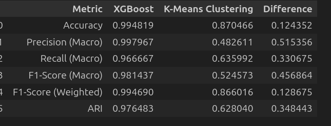

# Diabetes Classification Project
This project aims to analyze a multi-class diabetes dataset and develop machine learning models that can accurately predict the diabetic status of individuals using both supervised classification and unsupervised clustering approaches. 

Here I have tested 4 different classification algorithms including Logistic Regression, Random Forest, SVM, and XGBoost. I've also tested 3 clustering algorithms including K-Means, Hierarchical Clustering (Ward), and Hierarchical Clustering (Average).

By selecting the best models from both approaches, I have compared their performance using various evaluation metrics to determine which method is more effective for diabetes classification.

Here is the evaluation table:

Conclusion:

The best supervised model, XGBoost, achieves 99.48% accuracy while the best clustering model, K-Means, achieves 87% accuracy.

Supervised models are best for accurate predictions, while clustering helps us understand patterns and groups in the data.

**Complete Report:** [Diabetes_Classification_Report.pdf](./docs/Multi-Class_Diabetes_Prediction%20.pdf)

